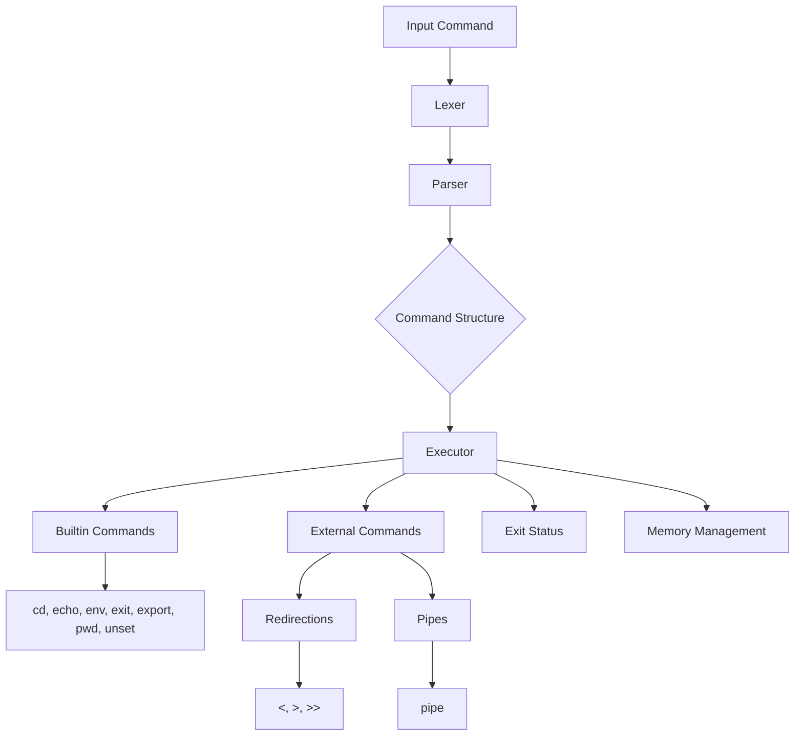
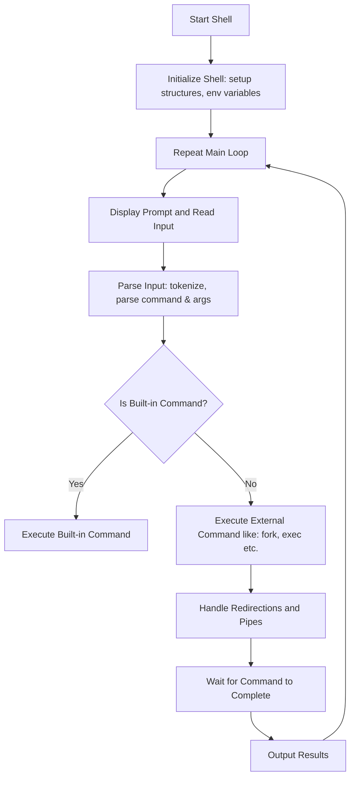

# Minishell
MiniShell (a 42 School project) is a simple UNIX shell implementation written in C. It supports basic shell functionalities including command execution, built-in commands, input parsing, and more. This project serves as a foundational example of how a shell works at a low level. Here's a detailed technical documentation and analysis of the `minishell` project, focusing on its structure and key components such as the parser, lexer, builtins, redirections, pipes, exit status, and memory leak checks.

***
In this documentation (README.md), some code fractions—provided to make the explanation of this project as clear as possible—may not correspond exactly to the source code of this project.
***

### Getting Started
### Prerequisites
- GCC compiler
- Make

### Building the Project
To build the MiniShell project, run the following command in the root directory:

```sh
make
```

This will compile the source files and create the minishell executable.

### Running Minishell
After building the project, you can run the shell with:
```sh
./minishell
```

## Project Structure

```html
<!DOCTYPE html>
<html>
<head>
<style>
.tree ul {
    padding-top: 20px; position: relative;
    transition: all 0.5s;
}
.tree li {
    float: left; text-align: center;
    list-style-type: none;
    position: relative;
    padding: 20px 5px 0 5px;
    transition: all 0.5s;
}
.tree li::before, .tree li::after {
    content: '';
    position: absolute; top: 0; right: 50%;
    border-top: 2px solid #ccc;
    width: 50%; height: 20px;
}
.tree li::after{
    right: auto; left: 50%;
    border-left: 2px solid #ccc;
}
.tree li:only-child::after, .tree li:only-child::before {
    display: none;
}
.tree li:only-child{ padding-top: 0;}
.tree li:first-child::before, .tree li:last-child::after{
    border: 0 none;
}
.tree li:last-child::before{
    border-right: 2px solid #ccc;
    border-radius: 0 5px 0 0;
}
.tree li:first-child::after{
    border-radius: 5px 0 0 0;
}
.tree ul ul::before{
    content: '';
    position: absolute; top: 0; left: 50%;
    border-left: 2px solid #ccc;
    width: 0; height: 20px;
}
.tree li a{
    border: 2px solid #ccc;
    padding: 5px 10px;
    text-decoration: none;
    color: #666;
    font-family: arial, verdana, tahoma;
    font-size: 11px;
    display: inline-block;
    border-radius: 5px;
    transition: all 0.5s;
}
.tree li a:hover, .tree li a:hover+ul li a {
    background: #c8e4f8; color: #000; border: 2px solid #94a0b4;
}
.tree li a:hover+ul li::after, 
.tree li a:hover+ul li::before, 
.tree li a:hover+ul::before, 
.tree li a:hover+ul ul::before{
    border-color:  #94a0b4;
}
</style>
</head>
<body>

<div class="tree">
    <ul>
        <li>
            <a href="#">minishell/</a>
            <ul>
                <li><a href="#">Makefile</a></li>
                <li><a href="#">README.md</a></li>
                <li>
                    <a href="#">includes/</a>
                    <ul>
                        <li><a href="#">builtin.h</a></li>
                        <li><a href="#">executor.h</a></li>
                        <li><a href="#">mini_shell.h</a></li>
                        <li><a href="#">parser.h</a></li>
                        <li><a href="#">structure.h</a></li>
                        <li><a href="#">utils.h</a></li>
                        <li><a href="#">visual.h</a></li>
                    </ul>
                </li>
                <li>
                    <a href="#">lib/</a>
                    <ul>
                        <li>
                            <a href="#">libft/</a>
                            <ul>
                                <li><a href="#">Makefile</a></li>
                                <li><a href="#">*.c</a></li>
                                <li><a href="#">libft.h</a></li>
                            </ul>
                        </li>
                    </ul>
                </li>
                <li>
                    <a href="#">src/</a>
                    <ul>
                        <li>
                            <a href="#">builtin/</a>
                            <ul>
                                <li><a href="#">*.c</a></li>
                            </ul>
                        </li>
                        <li>
                            <a href="#">executor/</a>
                            <ul>
                                <li><a href="#">*.c</a></li>
                            </ul>
                        </li>
                        <li>
                            <a href="#">parser/</a>
                            <ul>
                                <li><a href="#">*.c</a></li>
                            </ul>
                        </li>
                        <li>
                            <a href="#">utils/</a>
                            <ul>
                                <li><a href="#">*.c</a></li>
                            </ul>
                        </li>
                        <li>
                            <a href="#">visual/</a>
                            <ul>
                                <li><a href="#">*.c</a></li>
                            </ul>
                        </li>
                    </ul>
                </li>
            </ul>
        </li>
    </ul>
</div>

</body>
</html>
```

## Key Components

### Parser & Lexer

The parser and lexer are essential components that process the input command line and convert it into executable commands.

- **Lexer**: The lexer breaks down the input string into tokens. Tokens are the smallest units (like keywords, identifiers, literals) that make up the command.
  - **Files**: `lexer_list.c`, `lexer_list_utils.c`
  - **Functions**: Token creation, token linking, and handling special characters.

- **Parser**: The parser takes the tokens produced by the lexer and organizes them into a structured format (typically an abstract syntax tree or a similar structure).
  - **Files**: `parser.c`
  - **Functions**: Handling syntax rules, constructing command structures, and managing precedence and associativity of operators.

### Redirections and Pipes

Redirections and pipes are used to control the flow of input and output in the shell.

- **Redirections**:
  - **Files**: `redirection_here.c`, `redirection_in.c`, `redirection_out.c`
  - **Functions**: Implementing `<` (input redirection), `>` (output redirection), and `>>` (append output redirection).

- **Pipes**:
  - **Files**: `exe_main.c`, `exe_utils.c`
  - **Functions**: Creating pipes, forking processes, and setting up communication between commands via pipes.

### Exit Status

The exit status of commands is crucial for scripting and command chaining.

- **File**: Various (integrated into command execution and builtins)
- **Functions**: Retrieving and storing the exit status of the last executed command, using `$?` to represent the exit status in the shell.

### Builtin Commands

Builtin commands are shell commands implemented within the shell itself, not as separate executables.

- **Files**: `builtin.h`, `my_cd.c`, `my_echo.c`, `my_env.c`, `my_exit.c`, `my_export.c`, `my_pwd.c`, `my_unset.c`, `builtins_utils.c`
- **Functions**: Implementing builtins like `cd`, `echo`, `env`, `exit`, `export`, `pwd`, and `unset`.

### Memory Leak Checks

Memory management is crucial in C programs to avoid leaks.

- **Files**: `my_free.c`, `general_utils.c`
- **Functions**: Proper allocation and deallocation of memory, using tools like Valgrind to check for leaks.

## Detailed Component Analysis

### Parser & Lexer

1. **Lexer Logic**:
    - The lexer reads the input string and categorizes substrings into tokens.
    - Handles quotes, escapes, and special characters (e.g., `|`, `<`, `>`).
    - Uses functions like `create_token`, `add_token_to_list`.

    Example for lexer logic:
    - Input: `ls -l | grep "pattern" > output.txt`
    - Tokens: `ls`, `-l`, `|`, `grep`, `pattern`, `>`, `output.txt`.

2. **Parser Logic**:
    - Constructs command structures from tokens.
    - Implements syntax rules for sequences, pipes, and redirections.

    Example for parser logic:
    - Tokens: `ls`, `-l`, `|`, `grep`, `pattern`, `>`, `output.txt`.
    - Parse Tree:
      - Command: `ls -l`
      - Pipe to: `grep "pattern"`
      - Redirect output to: `output.txt`

    - Code Example:
      ```c
      while (tokens)
      {
          if (is_pipe(tokens))
              handle_pipe(tokens);
          else if (is_redirection(tokens))
              handle_redirection(tokens);
          else
              handle_command(tokens);
          tokens = tokens->next;
      }
      ```

### Redirections and Pipes

1. **Redirections**:
    - **Input Redirection (`<`)**: Redirects input from a file.
    - **Output Redirection (`>`)**: Redirects output to a file.
    - **Append Output (`>>`)**: Appends output to a file.
    - Example function for input redirection:
      ```c
      void handle_input_redirection(char *file)
      {
          int fd = open(file, O_RDONLY);
          if (fd == -1)
              perror("open");
          else
              dup2(fd, STDIN_FILENO);
          close(fd);
      }
      ```

2. **Pipes**:
    - Sets up pipes using `pipe()`, forks processes with `fork()`.
    - Example:
      ```c
      int pipefd[2];
      pipe(pipefd);
      if (fork() == 0) // Child process
      {
          dup2(pipefd[1], STDOUT_FILENO);
          close(pipefd[0]);
          close(pipefd[1]);
          execvp(cmd1[0], cmd1);
      }
      else // Parent process
      {
          dup2(pipefd[0], STDIN_FILENO);
          close(pipefd[1]);
          close(pipefd[0]);
          execvp(cmd2[0], cmd2);
      }
      ```

### Exit Status

The exit status indicates the result of the last executed command. In UNIX-like systems, an exit status of 0 typically means success, while a non-zero value indicates an error.
- Stored in a global variable.
- Accessible via `$?` in the shell (implemented in the echo builtin).

#### Example
```c
// exit_status.c
#include "exit_status.h"

void set_exit_status(int status) {
    g_shell_status = status;
}

int get_exit_status() {
    return g_shell_status;
}
```

### Builtin Commands

- Implemented as functions that directly manipulate the shell's state:
  - `cd`: Changes the current directory.
  - `echo`: Prints text to the standard output.
  - `pwd`: Prints the current working directory.
  - `export`: Sets environment variables.
  - `unset`: Unsets environment variables.
  - `env`: Prints all environment variables.
  - `exit`: Exits the shell.

- Example for `cd`:
  ```c
  void my_cd(char **args)
  {
      if (args[1] == NULL)
          fprintf(stderr, "cd: expected argument\n");
      else if (chdir(args[1]) != 0)
          perror("cd");
  }
  ```

### Memory Leak Checks

- Ensures all allocated memory is freed.
- Uses functions like `free_command_structure` to clean up.

## Process Flow
To understand the pure logic of the shell program, it's helpful to break it down into its core components and their interactions.

### Core Components and Logic
#### Initialization
- **Start Shell**: The entry point where the shell program begins execution.
- **Initialize Shell**: Sets up necessary data structures and environment variables to prepare the shell for operation.

##### Simple Overview (Part One)
```c
void init_shell(t_shell *shell); // initializes the shell struct
```
```c
void start_shell(t_shell *shell); // starts the shell, entering the main loop where it waits for user input
```

#### Main Loop
The shell enters a main loop where it continuously waits for user input. This loop only breaks when the user exits the shell.

- **Display Prompt and Read Input**: The shell displays a prompt (e.g., $ ) to the user and waits for the user to type a command.
- **Parsing**: The input is tokenized and parsed into a structured format that the shell can understand (e.g., separating the command and its arguments).

- **Command Execution**: The shell determines whether the command is a built-in command or an external program. If it is a built-in command, the corresponding function is called. If it is an external program, the shell uses `fork` to create a new process and `exec` to run the program. The shell handles redirections (input/output) and pipes if specified.

##### Simple Overview (Part Two)
```c
t_command *parse_input(char *input); // parses the user input and returns a structured command
```
```c
void execute_command(t_command *cmd); // executes

 the given command, handling built-in commands and external programs
```

- **Waiting for Completion**: The shell waits for the command to complete if it is running in the foreground. For background processes, it immediately returns to the prompt. The shell outputs the results of the command execution (if any) to the terminal.

- **Repeat**: The shell repeats the loop, waiting for the next user input.

## Visual Diagram



### Detailed Logic Flowchart



This detailed documentation covers the main aspects of the `minishell` project, including its structure, parser, lexer, redirections, pipes, exit status, builtins, and memory management. It provides a foundation for understanding how each component functions and interacts within the shell.

## Author & License

Group project by [Ani Mema](https://github.com/amema42), [Jacopo Cardinaux](https://github.com/raviolotto), [Luca Morelli](https://github.com/lmorelli333), and [Francesco Dal Savio](https://github.com/francescodalsavio).

This project is licensed under the MIT License.
```css
This `README.md` file consolidates all the detailed explanations, code examples, and logical flow of this MiniShell project.
```
