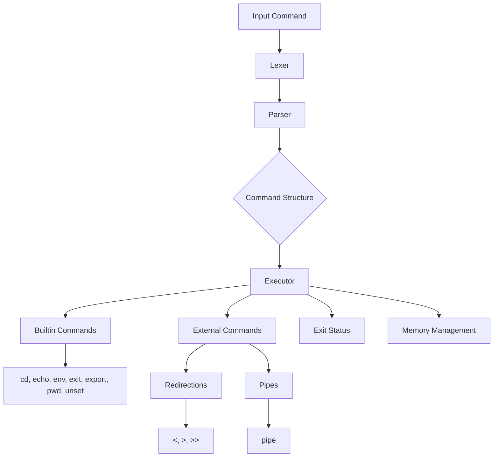

#Minishell
Here's a detailed technical documentation and analysis of the `minishell` project, focusing on its structure and key components such as the parser, lexer,  builtins, redirections, pipes, exit status, and leak checks.

## Project Structure
```
minishell/
├── includes/       # Header files
├── lib/            # Libraries (libft and ft_printf)
├── src/            # Source files
│   ├── builtin/    # Builtin commands
│   ├── executor/   # Command execution
│   ├── parser/     # Parsing and lexing
│   └── utils/      # Utility functions
├── Makefile        # Build script
└── README.md       # Project documentation (this file)
```

## Key Components

### Parser & Lexer

The parser and lexer are essential components that process the input command line and convert it into executable commands.

- **Lexer**: The lexer breaks down the input string into tokens. Tokens are the smallest units (like keywords, identifiers, literals) that make up the command.
  - **Files**: `lexer_list.c`, `lexer_list_utils.c`
  - **Functions**: Token creation, token linking, and handling special characters.

- **Parser**: The parser takes the tokens produced by the lexer and organizes them into a structured format (typically an abstract syntax tree or a similar structure).
  - **Files**: `parser.c`
  - **Functions**: Handling syntax rules, constructing command structures, and managing precedence and associativity of operators.

### Redirections and Pipes

Redirections and pipes are used to control the flow of input and output in the shell.

- **Redirections**:
  - **Files**: `redirection_here.c`, `redirection_in.c`, `redirection_out.c`
  - **Functions**: Implementing `<` (input redirection), `>` (output redirection), and `>>` (append output redirection).

- **Pipes**:
  - **Files**: `exe_main.c`, `exe_utils.c`
  - **Functions**: Creating pipes, forking processes, and setting up communication between commands via pipes.

### Exit Status

The exit status of commands is crucial for scripting and command chaining.

- **File**: Various (integrated into command execution and builtins)
- **Functions**: Retrieving and storing the exit status of the last executed command, using `$?` to represent the exit status in the shell.

### Builtin Commands

Builtin commands are shell commands implemented within the shell itself, not as separate executables.

- **Files**: `builtin.h`, `my_cd.c`, `my_echo.c`, `my_env.c`, `my_exit.c`, `my_export.c`, `my_pwd.c`, `my_unset.c`, `builtins_utils.c`
- **Functions**: Implementing builtins like `cd`, `echo`, `env`, `exit`, `export`, `pwd`, and `unset`.

### Memory Leak Checks

Memory management is crucial in C programs to avoid leaks.

- **Files**: `my_free.c`, `general_utils.c`
- **Functions**: Proper allocation and deallocation of memory, using tools like Valgrind to check for leaks.

## Detailed Component Analysis

### Parser & Lexer

1. **Lexer Logic**:
    - The lexer reads the input string and categorizes substrings into tokens.
    - Handles quotes, escapes, and special characters (e.g., `|`, `<`, `>`).
    - Uses functions like `create_token`, `add_token_to_list`.

2. **Parser Logic**:
    - Constructs command structures from tokens.
    - Implements syntax rules for sequences, pipes, and redirections.
    - Example:
      ```c
      while (tokens)
      {
          if (is_pipe(tokens))
              handle_pipe(tokens);
          else if (is_redirection(tokens))
              handle_redirection(tokens);
          else
              handle_command(tokens);
          tokens = tokens->next;
      }
      ```

### Redirections and Pipes

1. **Redirections**:
    - **Input Redirection (`<`)**: Redirects input from a file.
    - **Output Redirection (`>`)**: Redirects output to a file.
    - **Append Output (`>>`)**: Appends output to a file.
    - Example function for input redirection:
      ```c
      void handle_input_redirection(char *file)
      {
          int fd = open(file, O_RDONLY);
          if (fd == -1)
              perror("open");
          else
              dup2(fd, STDIN_FILENO);
          close(fd);
      }
      ```

2. **Pipes**:
    - Sets up pipes using `pipe()`, forks processes with `fork()`.
    - Example:
      ```c
      int pipefd[2];
      pipe(pipefd);
      if (fork() == 0) // Child process
      {
          dup2(pipefd[1], STDOUT_FILENO);
          close(pipefd[0]);
          close(pipefd[1]);
          execvp(cmd1[0], cmd1);
      }
      else // Parent process
      {
          dup2(pipefd[0], STDIN_FILENO);
          close(pipefd[1]);
          close(pipefd[0]);
          execvp(cmd2[0], cmd2);
      }
      ```

### Exit Status

- Stored in a global variable or a special structure.
- Accessible via `$?` in the shell.

### Builtin Commands

- Implemented as functions that directly manipulate the shell's state.
- Example for `cd`:
  ```c
  void my_cd(char **args)
  {
      if (args[1] == NULL)
          fprintf(stderr, "cd: expected argument\n");
      else if (chdir(args[1]) != 0)
          perror("cd");
  }
  ```

### Memory Leak Checks

- Ensures all allocated memory is freed.
- Uses functions like `free_command_structure` to clean up.

## Visual Diagram



This detailed documentation covers the main aspects of the `minishell` project, including its structure, parser, lexer, redirections, pipes, exit status, builtins, and memory management. It provides a foundation for understanding how each component functions and interacts within the shell.
